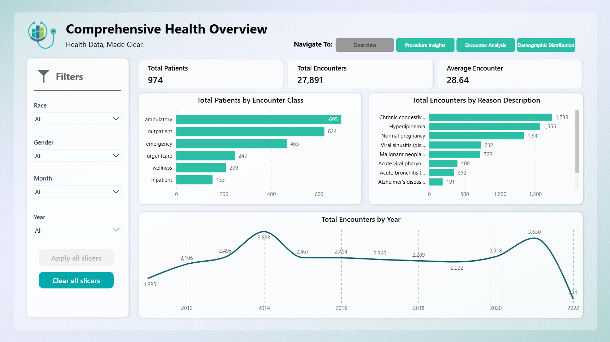
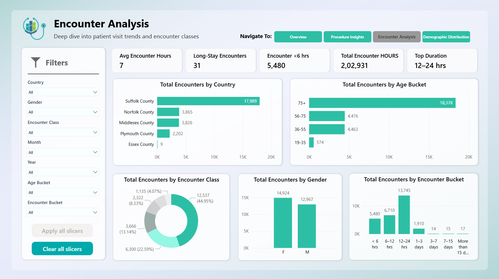
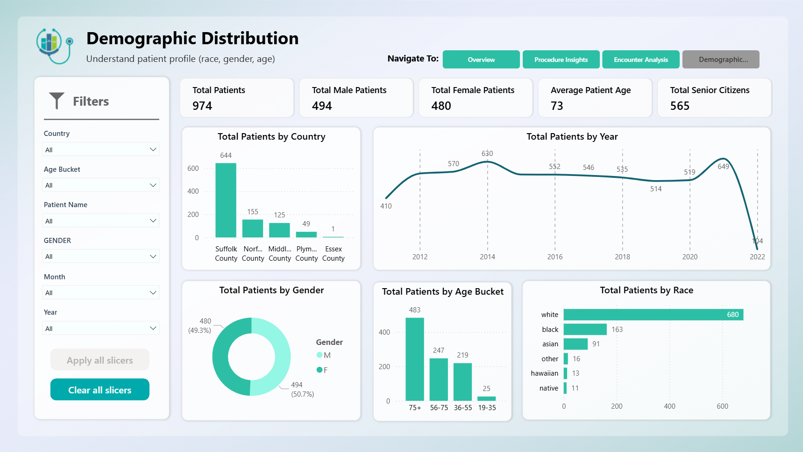
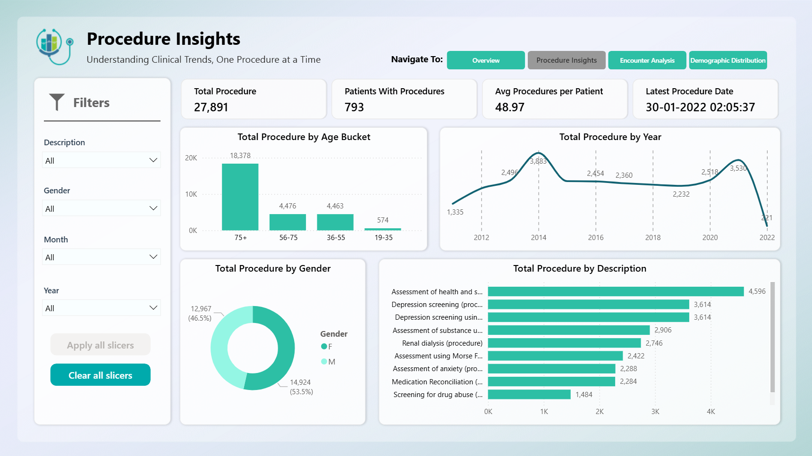

# Power BI Healthcare Dashboard  

## 📊 Project Overview  
This repository presents a Power BI Dashboard Project focused on providing deep insights into patient data, clinical procedures, and healthcare encounters.

The PBIX file is not shared publicly to protect the dataset, but the screenshots below demonstrate the dashboard's design and analytical capabilities.  

---

## 🖼️ Dashboard Snapshots  

### Dashboard 1 – Comprehensive Health Overview Dashboard
  

### Dashboard 2 – Procedure Insights Dashboard  
  

### Dashboard 3 – Encounter Analysis Dashboard  

### Dashboard 4 – Demographic Distribution Dashboard  

---

## ⚙️ Key Features  
- Comprehensive Overview: At-a-glance view of total patients, encounters, and key metrics.
- Procedure Analysis: Tracking of clinical procedure trends and frequency.
- Encounter Breakdown: Detailed analysis of patient visits by duration, location, and reason.
- Demographic Insights: Breakdown of the patient population by age, gender, race, and location.
- KPI cards: Dynamic insights for total patients, encounters, procedures, and more.
- Interactive Charts: Visuals including bar charts, pie charts, and trend lines for in-depth analysis. 

---

## 🚀 Tech Stack  
- **Tool:** Power BI  
- **Data Source:** Excel (dummy dataset for practice)  
- **Language:** DAX for custom calculations and measures  

---

## 📬 Contact  
- **Author:** Aryan Patel  
- **LinkedIn:** [Your LinkedIn Link]  
- **Email:** [Your Email]  
